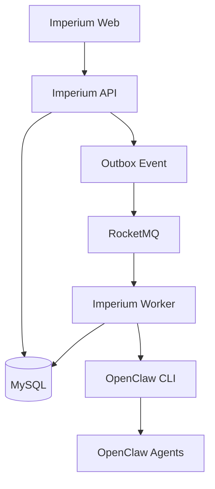

# 总体架构与技术选型

## 1. 设计目标

`Imperium` 的技术架构需要满足以下目标：

- 支持“法令 -> 议案 -> 辩论 -> 否决 -> 裁决 -> 执行 -> 审计 -> 归档”的完整制度闭环
- 支持多角色异步协作，同时保留强状态机与权限边界
- 支持完整活动流、审计记录与历史追踪
- 支持通过 OpenClaw CLI 进行 Agent 调用
- 支持 Docker 化部署与本地一键启动
- 支持从 MVP 平滑演进到更复杂的生产环境形态

## 2. 架构风格

推荐采用：

- 模块化单体
- 事件驱动
- 异步执行

不建议当前阶段直接采用微服务架构。

原因如下：

- 业务复杂度当前主要在制度编排，而不是服务边界拆分
- 微服务会过早引入注册发现、分布式事务、链路治理等额外复杂度
- 模块化单体更适合先把领域模型、状态机、调度逻辑做稳定
- 通过 RocketMQ 仍然可以实现异步解耦和后续扩展能力

## 3. 技术基线

### 3.1 后端

- Java 21 LTS
- Spring Boot 3.x 最新稳定版
- Spring Web
- Spring Validation
- Spring Retry
- Spring Scheduling
- MyBatis-Plus
- Flyway
- MapStruct
- Lombok
- Jackson
- springdoc-openapi

### 3.2 数据与中间件

- MySQL 8.4 LTS
- RocketMQ 5.x 最新稳定版

### 3.3 前端

推荐默认方案：

- React 19
- TypeScript 5.x
- Vite 6
- Ant Design 5
- Zustand
- TanStack Query
- React Router

### 3.4 部署

- Docker
- Docker Compose
- Nginx
- OpenJDK 21 运行时镜像

## 4. 运行单元划分

建议拆成 3 个核心运行单元：

### `imperium-api`

职责：

- 对外提供 HTTP API
- 处理同步业务请求
- 执行状态流转校验
- 持久化业务数据
- 写出 Outbox 事件

### `imperium-worker`

职责：

- 消费 RocketMQ 事件
- 调用 OpenClaw CLI
- 执行元老院并行审议与聚合
- 执行停滞扫描、重试、升级、回滚
- 执行审计与归档异步任务

### `imperium-web`

职责：

- 托管前端静态资源
- 提供页面入口
- 通过 Nginx 反代后端 API

## 5. 总体结构图

## 6. 核心架构原则

### 6.1 数据库是事实源

所有核心状态、裁决、派发、审计结果必须先落库。

### 6.2 消息队列是异步驱动层

RocketMQ 负责驱动异步执行和解耦，不负责存储系统事实。

### 6.3 Agent 调用必须异步化

OpenClaw CLI 调用可能耗时较长，不能阻塞前端请求线程。

### 6.4 主流程不使用分布式事务

采用本地事务 + Outbox 模式，避免引入分布式事务框架。

### 6.5 当前阶段不引入 BPM 引擎

当前业务规则虽然复杂，但更适合代码化表达，不需要额外引入流程引擎。

## 7. 项目模块建议

后端代码建议按业务域和基础设施双维度拆分：

- `docket`
- `senate`
- `tribune`
- `caesar`
- `mandate`
- `execution`
- `audit`
- `archive`
- `timeline`
- `role`
- `integration`
- `infrastructure`

## 8. 设计结论

当前阶段最合适的技术形态是：

- Java 21 + Spring Boot 3.x
- MySQL 8.4 LTS
- RocketMQ 5.x
- React 19 + TypeScript
- OpenClaw CLI 异步调用
- Docker Compose 单机部署
- 模块化单体 + 事件驱动
